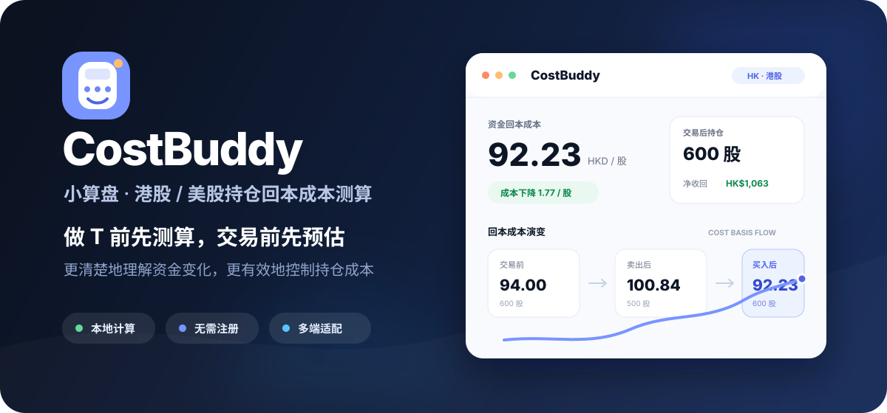

<div align="center">



<br />

# CostBuddy

### 做 T、加仓、减仓前，先把成本算清楚

**测算交易后的回本成本，预估不同方案的资金变化，更有效地控制自己的持仓成本。**

<p>
  <a href="https://costbuddy.space"></a>
  <a href="https://costbuddy.space/USER_GUIDE.html"></a>
</p>

<p>
  
  
  
  
  
  
  
</p>

[正式网站](https://costbuddy.space) · [GitHub Pages](https://ajinggo.github.io/costbuddy/) · [试用说明书](USER_GUIDE.md) · [网页版说明书](https://costbuddy.space/USER_GUIDE.html)

<br />

<sub>快速导航</sub><br />
[为什么做它？](#为什么做-costbuddy)　·　[产品界面](#产品界面)　·　[使用场景](#你可以用它做什么)　·　[核心功能](#核心功能)　·　[计算口径](#计算口径)

</div>

---

## 为什么做 CostBuddy？

交易前最难的往往不是按下买入或卖出，而是提前弄清楚：**做完这笔交易后，我的成本到底会变成多少？**

<table>
  <tr>
    <td width="33%" align="center">
      <h3>🧮 测算</h3>
      <p>计算做 T、加仓、减仓后的<br><strong>资金回本成本</strong></p>
    </td>
    <td width="33%" align="center">
      <h3>🔭 预估</h3>
      <p>比较不同价格与股数下的<br><strong>持仓和资金变化</strong></p>
    </td>
    <td width="33%" align="center">
      <h3>🎯 控制</h3>
      <p>在交易前看清方案，帮助自己<br><strong>更有效地控制成本</strong></p>
    </td>
  </tr>
</table>

> CostBuddy 不预测涨跌。它只负责把交易计划和成本变化算得更清楚，让每次操作多一份可量化的参考。

## 产品界面

<div align="center">
  <a href="https://costbuddy.space" title="打开 CostBuddy">
    <picture>
      <source media="(prefers-color-scheme: dark)" srcset="./assets/product-dark.jpg">
      <source media="(prefers-color-scheme: light)" srcset="./assets/product-desktop.jpg">
      
    </picture>
  </a>
  <sub>真实产品界面 · 图片会跟随系统深浅色模式切换 · 点击图片进入网站</sub>
</div>

<br />

<table>
  <tr>
    <td align="center"><strong>01 · INPUT</strong><br><sub>输入当前持仓与交易计划</sub></td>
    <td align="center"><strong>02 · CALCULATE</strong><br><sub>即时测算成本与资金变化</sub></td>
    <td align="center"><strong>03 · COMPARE</strong><br><sub>对比方案后再做决定</sub></td>
  </tr>
</table>

## 你可以用它做什么？

| 场景 | CostBuddy 可以帮你 |
| --- | --- |
| 🔁 **做 T 测算** | 同时输入卖出与买回计划，测算完成一轮交易后的新回本成本 |
| 📉 **摊薄成本** | 预估不同买入价格、股数和费用对持仓成本的影响 |
| 📤 **减仓预估** | 查看卖出后剩余持仓需要收回的资金与每股回本成本 |
| 🎯 **目标反推** | 输入目标成本，反推理论买入股数和港股最少整手方案 |
| 🧩 **方案比较** | 对比 1–5 手方案，保存方案 A / B 后查看资金与成本差异 |
| 📚 **多股管理** | 使用持仓簿保存多只股票，随时继续下一次测算 |
| 💾 **跨设备使用** | 通过 JSON 导出 / 导入，在另一台电脑继续计算 |

## 30 秒开始测算

<div align="center">

`输入当前持仓`　→　`设置买卖计划`　→　`查看回本成本`　→　`比较方案后再决定`

</div>

1. 选择 **港股 / 美股**。
2. 输入目前股数、目前成本和当前股价。
3. 填写计划买入或卖出的价格、股数与费用。
4. 查看回本成本、资金明细、目标反推和方案比较。

<div align="center">
  <a href="https://costbuddy.space"><strong>立即打开 CostBuddy →</strong></a>
</div>

## 核心功能

<table>
  <tr>
    <td width="50%" valign="top">
      <h3>📊 成本与资金</h3>
      <ul>
        <li><strong>COST BASIS FLOW</strong> 回本成本演变</li>
        <li><strong>PRICE / BASIS</strong> 股价与回本价</li>
        <li><strong>CASH LEDGER</strong> 资金明细</li>
        <li><strong>MARKET CURVE</strong> 买入价与回本成本</li>
      </ul>
    </td>
    <td width="50%" valign="top">
      <h3>🧭 计划与方案</h3>
      <ul>
        <li><strong>TARGET BASIS</strong> 目标成本反推</li>
        <li><strong>LOT MATRIX</strong> 1–5 手买入方案</li>
        <li>方案 A / B 保存和对比</li>
        <li>买入、卖出或全部计划一键清除</li>
      </ul>
    </td>
  </tr>
  <tr>
    <td width="50%" valign="top">
      <h3>💼 持仓与数据</h3>
      <ul>
        <li>多股票持仓簿</li>
        <li>新建空白测算</li>
        <li>复制结果与分享链接</li>
        <li>JSON 备份和恢复</li>
      </ul>
    </td>
    <td width="50%" valign="top">
      <h3>🖥️ 多端体验</h3>
      <ul>
        <li>桌面一屏三列工作台</li>
        <li>手机端输入 / 结果二级页面</li>
        <li>4K 居中加宽布局</li>
        <li>高对比日间模式与暗蓝夜间模式</li>
      </ul>
    </td>
  </tr>
</table>

<details>
<summary><strong>展开查看费用设置</strong></summary>
<br>

- 支持手动填写买入和卖出费用
- 支持根据成交金额自动估算费用
- 港股可设置佣金率、最低佣金、印花税和交收费
- 美股可设置佣金及相关监管费用参数
- 某一侧交易股数为 `0` 时，该侧手续费不计入结果

自动费用仅为估算，实际费用请以券商成交单为准。

</details>

## 计算口径

CostBuddy 使用“资金回本成本”口径，将已实现的卖出盈亏继续反映到剩余持仓中：

```text
资金回本成本 =
[
  原持仓股数 × 目前成本
  -（卖出股数 × 卖出价格 - 卖出费用）
  +（买入股数 × 买入价格 + 买入费用）
]
÷ 交易后持仓股数
```

```text
交易后持仓股数 = 原持仓股数 - 卖出股数 + 买入股数
```

| 情况 | 可能产生的结果 |
| --- | --- |
| 盈利卖出 | 通常降低后续资金回本成本 |
| 亏损卖出 | 通常提高后续资金回本成本 |
| 卖出净所得超过待回收资金 | 回本成本可能为负数 |
| 完全清仓 | 不再计算剩余持仓的每股回本成本 |

> 该结果可能与券商按照成交批次或会计口径展示的账面平均成本不同。

## 本地优先，数据不上云

<div align="center">

**无需注册　·　本地计算　·　LocalStorage 保存　·　支持 JSON 备份**

</div>

- 输入、持仓簿、方案和费用设置默认保存在当前浏览器中
- 网站不会自动上传你的持仓数据
- 分享链接会包含当前测算参数，请按需使用
- 更换电脑或浏览器前，建议先导出 JSON 备份
- 清除浏览器网站数据可能删除尚未导出的本地记录

## 本地运行

无需安装依赖或执行构建：

```bash
git clone https://github.com/ajinggo/costbuddy.git
cd costbuddy
python3 -m http.server 8765
```

打开：

```text
http://localhost:8765/
```

也可以直接使用浏览器打开 `index.html`。

<details>
<summary><strong>查看项目结构</strong></summary>
<br>

```text
.
├── assets/
│   ├── readme-cover.svg   # README 品牌封面
│   ├── product-desktop.jpg # 日间产品界面
│   └── product-dark.jpg    # 夜间产品界面
├── index.html            # 页面结构与内容
├── styles.css            # 响应式、日间和夜间样式
├── calculator.js         # 计算、持仓、方案、备份与分享逻辑
├── USER_GUIDE.md         # Markdown 试用说明书
├── USER_GUIDE.html       # 网页版试用说明书
├── favicon.svg           # 网站图标
└── README.md             # 项目说明
```

</details>

## 技术与部署

<p>
  
  
  
  
  
</p>

- 原生 HTML / CSS / JavaScript
- 无框架、无打包、无安装依赖
- `main` 分支推送后由 Vercel 自动触发生产部署
- GitHub Pages 提供静态备用入口

## 支持与反馈

- 意见邮箱：[`imurio@163.com`](mailto:imurio@163.com?subject=CostBuddy%20使用建议)
- 微信号：`idemising`

如果 CostBuddy 对你有帮助，欢迎推荐给需要测算做 T、加仓或摊薄成本的朋友。

## 风险提示

> 结果仅用于持仓测算与方案预估，不构成投资建议；暂不包含汇率及未明确录入的其他费用。自动费用为估算值，应以交易所、监管机构及实际券商成交单为准。

<div align="center">

<a href="https://costbuddy.space"></a>

<br />
<br />

Made for clearer cost decisions · **CostBuddy 小算盘**

[返回顶部](#costbuddy)

</div>
